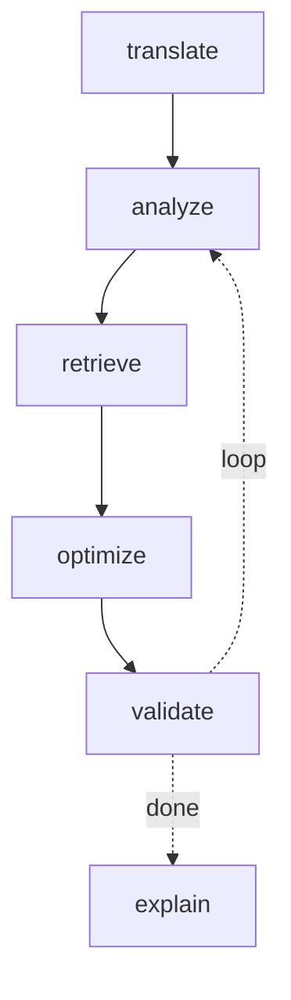

# SQLSpark Optimizer

**A multi-agent system that optimizes SQL→PySpark queries and _proves the output is still correct_ with an evaluation layer that measures routing, cost, and speedup at every stage.**

Most query-optimizer demos _transform_ a query. This one proves each transformation is output-identical and measures what it costs(the part those demos skip).

---

## The idea

Cloud data compute is often a company's biggest infra bill, and inefficient queries (missing broadcast joins, filters that can't push down, skew) silently waste a large fraction of it. This system:

1. reads a query's **physical plan**, detects an anti-pattern,
2. **retrieves** the right fix (RAG over a tuning-knowledge base),
3. applies it, **re-runs both queries and proves the result is unchanged**,
4. **measures** the speedup and the cost-per-stage,

…all wired into one orchestrated, observable multi-agent flow. The **validation** is what makes it trustworthy; the **measurement** is what makes it a business case.

## The agents

| Agent         | Job                                          | Backed by                  |
| ------------- | -------------------------------------------- | -------------------------- |
| Translator    | SQL → Spark SQL                              | SQLGlot (AST)              |
| Plan-Analyzer | read the physical plan, detect anti-patterns | Spark + Neo4j (plan = DAG) |
| Optimizer     | apply the fix (rule registry)                | pgvector (RAG retrieval)   |
| Validator     | run both queries, assert identical output    | DuckDB + Spark             |
| Orchestrator  | route the query, loop optimize→validate      | LangGraph                  |
| Observability | trace routing, cost/stage, before/after      | MLflow                     |



## What happens in each phase

- **Phase 0 - Environment + data.** DuckDB generates the TPC-H dataset _and_ the 22 benchmark queries _and_ a trusted correctness oracle. Foundation + a built-in answer key.
- **Phase 1 - The spine (translate + validate).** Translate SQL→Spark, run it, and **prove** it returns the same result as DuckDB. Validation is built _before_ optimization, so everything downstream is trustworthy by construction. Instrumented in MLflow from here on.
- **Phase 2 - Optimize → validate → measure.** Detect a **broadcast-join** anti-pattern from the physical plan, apply a planner hint, prove the answer is unchanged, and measure the speedup (**2.8–4.3×**). Then a second, harder pattern **predicate pushdown** (a sargable rewrite AQE/Catalyst _don't_ do) - generalized into a pluggable **rule registry**. Plans are persisted to **Neo4j** as a queryable graph.
- **Phase 3 - Orchestration + cost routing.** All agents wired into a **LangGraph** state graph with a convergence loop and revert-on-failure safety. Retrieval _drives_ optimization (symptom → pgvector → rule). **Cost routing** sends mechanical stages to a $0 local tier and the one reasoning stage to a smart model, logging cost per stage.
- **Phase 4 - Eval layer.** The differentiator: a curated eval set with _known expected fixes_, scored into published metrics. This turns every claim into a measured number.

## Measured results (TPC-H sf=1)

| metric                         | value     |
| ------------------------------ | --------- |
| correctness (output-identical) | **100%**  |
| routing accuracy               | **100%**  |
| avg speedup                    | **2.22×** |
| avg convergence iterations     | 1.83      |
| optimizer cost                 | $0        |

_Honest note:_ join optimizations win big (up to 4.3×); pushdown rewrites are output-correct but runtime-flat unless the data is clustered by the filter column (row-group skipping). The plan-level win is always real; the runtime win is data-dependent.

## Quickstart

```bash
python -m venv .venv && source .venv/Scripts/activate   # Windows: .\.venv\Scripts\Activate.ps1
pip install -e .

python data/tpch_setup.py --sf 1        # generate TPC-H data + queries (~300MB)
python phase4_eval.py                    # run the eval set → metrics
```

Use it as a library or a CLI:

```python
from sqlspark_optimizer import optimize
result = optimize(sql, spark, parquet_dir="data/tpch", source_dialect="duckdb")
print(result.optimized_sql, result.speedup, result.explanation)
```

```bash
sqlspark draw                                            # orchestrator diagram
sqlspark optimize query.sql --data data/tpch --dialect duckdb
sqlspark workload --data data/tpch --queries data/tpch_queries.json --all
```

Optional services (all Docker, all free): **Neo4j** (plan graph), **pgvector** (RAG), **MLflow UI** (traces), **Ollama/Gemini** (the reasoning tier). Every one is best-effort - the pipeline runs without them.

## Tech stack

PySpark · DuckDB · SQLGlot · LangGraph · MLflow · pgvector · Neo4j · sentence-transformers · Ollama/Gemini

## Status

Phases 0-4 complete. Next: LLM escalation path for novel anti-patterns, whole-workload scale testing, and a web UI + plan visualizer. See [`docs/design-rationale.md`](docs/design-rationale.md) for the _why_ behind each decision and [`docs/learning-notes.md`](docs/learning-notes.md) for the concepts.
