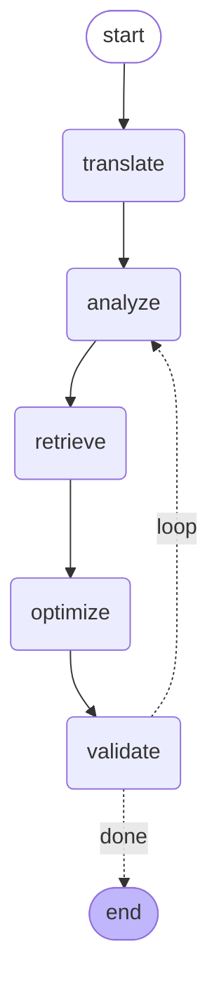

# Design Rationale — Why This Project Is Different

Companion to [learning-notes.md](learning-notes.md). That doc explains the *tech*;
this doc explains the *decisions* — what we chose, why, the advantage, and the
honest trade-off. Organized by phase. Mine this for the README and interviews.

**One-line thesis:** most multi-agent / query-optimizer demos *transform* a query.
This one **proves each transformation is correct and measures what it costs** —
the part those demos skip.

---

## Cross-cutting differentiators (true at every phase)

- **Correctness is proven, not assumed.** Every optimization is re-run and checked
  against ground truth. We never claim "faster" without "and identical output."
- **Instrumented from line one.** Observability (MLflow traces/runs) was wired in
  Phase 1, not bolted on at the end — so every claim is backed by logged data.
- **Observability is best-effort, never load-bearing.** If the MLflow server is
  down, the pipeline still runs — a fast 1s reachability check disables telemetry
  with a warning instead of crashing (or hanging on MLflow's minutes-long retry).
  A monitoring layer that takes down the system it monitors is a bug; tracing must
  never change behavior. (Learned the hard way: a missing `mlflow ui` once hung a
  run for 4 minutes then crashed it — fixed in observability/tracing.py.)
- **Narrow but complete.** One pattern, fully validated and measured, beats ten
  half-built ones. The architecture is proven on a slice, then widened.
- **Each agent is swappable.** Translator, Analyzer, Optimizer, Validator are
  independent. We can upgrade one (e.g. hardcoded fix → RAG retrieval) without
  touching the loop around it.
- **Honest about scope.** Where Spark/AQE already helps, we say so — and aim the
  project at what they *don't* do.

---

## Phase 0 — Environment + data

- **DuckDB generates both data AND queries.** One tool gives us the TPC-H dataset
  *and* the 22 standard queries *and* a trusted correctness oracle. Most projects
  hand-roll fixture data; we get a benchmark-grade, reproducible dataset free.
  - *Advantage:* the "do my outputs match?" question has a built-in answer key.
- **Parquet as the interchange format.** DuckDB writes Parquet; Spark reads it.
  Columnar + pushdown + schema-embedded = realistic analytics I/O.
- *Trade-off:* local single-node Spark isn't a cluster — fine for proving logic,
  not for raw scale claims. We're explicit about that.

---

## Phase 1 — The spine: translate + validate

- **Validation built BEFORE optimization.** The correctness proof exists before the
  thing it proves. This inverts the usual order and is the project's foundation.
  - *Advantage:* every later optimization is trustworthy by construction.
- **Translate via dialect transpilation, not DataFrame code-gen.** SQLGlot rewrites
  SQL into the Spark dialect (run via `spark.sql()`) instead of generating brittle
  `.groupBy().agg()` code.
  - *Advantage:* it actually runs on all 22 queries and still produces a real
    physical plan for Phase 2 to optimize. Nothing is lost.
  - *Honest nuance:* translation is the **commodity** step (for portable queries
    it's nearly a no-op). We don't pretend it's the hard part — validation is.
- **Compare by *meaning*, not bytes.** Row-order, float-drift, and dtype quirks are
  all normalized away, so PASS/FAIL reflects real correctness, not representation.
  - *Advantage:* no false failures, no false passes — the proof is sound.

---

## Phase 2 — Optimize → validate → measure (broadcast join)

### The hint-based optimization — what it is
Instead of rewriting the query's logic, the Optimizer injects a **planner hint**:

    SELECT /*+ BROADCAST(nation, supplier) */ ...

A hint is a directive to Spark's optimizer that **overrides its plan choice**
without changing *what* the query computes — only *how* it executes.

### Why hint-based is the right call (the advantages)
- **Surgical & output-preserving.** It changes execution strategy only. The SELECT
  list, filters, and grouping are untouched → results are guaranteed identical
  (and we still prove it). Far safer than rewriting query logic.
- **Reversible & inspectable.** The optimization is one visible comment in the SQL.
  You can read it, diff it, commit it, or remove it. Compare that to AQE silently
  re-planning at runtime with no artifact.
- **Overrides bad estimates.** The whole anti-pattern exists because Spark
  *mis-estimates* table size (missing stats). A hint bypasses the estimate and
  states the intent directly.
- **Composable.** Hints stack (`BROADCAST`, `MERGE`, `REPARTITION`, `COALESCE`),
  so the same injection mechanism extends to future patterns.
- *Trade-off:* a hint forces a choice, so a *wrong* hint (broadcasting a big table)
  could hurt — which is exactly why the Analyzer checks real size first and the
  Validator + measurement catch any regression.

### Why detect from the *physical plan* (not the SQL text)
We read what Spark will *actually execute*, not what the user wrote.
- *Advantage:* we see Spark's real strategy (SortMergeJoin vs Broadcast) and real
  scanned tables — catching problems invisible at the SQL level.

### Why on-disk size as the broadcast signal
A table's Parquet file size is a concrete, honest proxy for "is it small enough to
broadcast?" — independent of whatever (possibly stale) stats Spark has.
- *Advantage:* we catch the exact case Spark gets wrong (missing stats → no
  broadcast) by using a source of truth Spark ignored.

### Pattern 2 — sargable-predicate rewrite (predicate pushdown)
- **What:** rewrite a non-sargable filter `YEAR(l_shipdate) = 1994` into the
  equivalent sargable range `l_shipdate >= DATE '1994-01-01' AND < '1995-01-01'`,
  so Spark can push it into the Parquet scan (`PushedFilters`).
- **Why this pattern, deliberately:** it's the case **neither Catalyst nor AQE
  fixes** — Catalyst treats `YEAR(col)` as opaque, AQE only reacts to shuffle
  stats. It directly answers "what are we doing that Spark doesn't?"
- **Why it matters for the architecture:** it's a **logical rewrite** (changes the
  plan's meaning if wrong), so the Validator is *load-bearing* here, not
  belt-and-suspenders. This is the "risky transform that genuinely needs
  validation" half of the spectrum from Phase 2's validation-cost note.
- **Advantage:** done over the **AST** (SQLGlot), not string hacks — the optimizer
  now reasons about query *structure*, which is what lets it grow past one trick.
- **Honest trade-off:** the runtime win depends on selectivity and whether row
  groups can be skipped (data isn't sorted by shipdate). The robust, always-true
  result is the predicate moving into `PushedFilters` + fewer rows scanned.

### How this differs from AQE (the key objection)
AQE is reactive, per-query, narrow, and leaves no artifact. It can't prove
correctness, explain itself, persist a fix, or cover non-join patterns (pushdown,
pruning, caching, join reorder, whole-workload). We build the **validated,
observable system around optimization** — broadcast join just proves the loop.
(Full treatment in learning-notes.md → AQE section.)

### The rule registry (generalizing past one-off methods)
Patterns are now pluggable **Rules** (`agents/rules.py`), each a self-contained
`apply(sql, ctx) -> RuleResult | None`. The Optimizer just iterates the registry
and lets rules **chain** (a later rule sees the earlier rule's output). Adding a
pattern = adding a Rule; the optimize→validate→measure loop never changes.
- Categories: `join_strategy` (physical hint, safe) vs `predicate_pushdown`
  (logical rewrite, validation load-bearing).
- Current rules: `broadcast_join`, `sargable_year`, `substring_prefix`
  (`SUBSTRING(col,1,k)='US'` → `col LIKE 'US%'`, pushes as StringStartsWith).
- **Why this matters:** "predicate pushdown" isn't one rewrite — each non-sargable
  shape has its own equivalent (YEAR→range, SUBSTRING→LIKE, CAST-strip, …) and
  some aren't rewritable at all (MONTH, UPPER) where the rule correctly *doesn't
  fire*. A registry is the honest structure for a growing catalog — and it turns
  "which fix applies?" into a *retrieval* problem, which is exactly what pgvector
  will answer.

### Why hardcode the fix before adding RAG
With one pattern, "retrieve the right fix" is retrieving from a list of one —
pgvector RAG would add infrastructure and zero information. We prove the loop
first; retrieval swaps in cleanly when there are many patterns to choose from.

### Measured result (TPC-H sf=1, local single-node)
Demo query (lineitem ⋈ supplier ⋈ nation): SortMergeJoin → BroadcastHashJoin.
- Before: **1927 ms** → After: **686 ms** → **2.81× speedup**, output **identical**.
- Eliminated a ~180 MB shuffle of `lineitem` by broadcasting 25-row `nation` +
  10k-row `supplier`.

### The cost of validation (and why it's not a problem)
Validation runs the query twice (original + optimized) to compare outputs — a ~2×
cost. But it's a **one-time entry fee, amortized over the query's lifetime**: pay
2× once, save ~64% on *every* subsequent run forever. Net positive after a handful
of executions.

Key nuance — **not all optimizations need full validation:**
- **Hint-based changes (broadcast, merge, repartition, cache)** change only the
  *physical* plan, not the logical plan → output is identical *by construction*.
  Validation is belt-and-suspenders; a cheap sample/fingerprint check suffices.
- **Logical rewrites (pushdown we inject, subquery elimination, join reorder)** can
  change results → full validation required.

Corporate-realistic validation (cheap → thorough): sample/`TABLESAMPLE` the data;
run on a dev/staging replica not prod; run off-peak as a batch; replace full
DataFrame compare with a **result fingerprint** (row count + checksum of sorted
output); and **tier rigor by risk** (skip/sample safe hints, full-validate logical
rewrites). This is "difficulty-based cost routing" applied to the validator.

---

## Phase 3 — Orchestration (LangGraph)

The agents are wired into one explicit state graph with a convergence loop and a
revert-on-failure branch. Generated live with `python phase3_orchestrate.py --draw`:

- **Retrieval drives optimization:** analyze names a symptom → pgvector picks the
  rule → optimizer applies exactly that rule. RAG→action, not RAG-as-decoration.
- **The loop is a conditional edge:** `validate` routes via `decide()` back to
  `analyze` (re-examine the now-optimized query) or to END. Converges when no new
  symptom is found.
- **Safety branch:** validation fail → revert to last good SQL → END.
- **Why LangGraph (honest):** a while-loop would work for deterministic agents; the
  graph makes structure explicit/inspectable and is the right foundation for the
  LLM-backed nodes next (streaming, checkpoints, human-in-the-loop). See
  learning-notes → LangGraph.

### Cost routing (the model-tier story)
The thesis: *send each stage to the right-sized model and measure what it costs.*
- **Mechanical stages** (translate, analyze, optimize) are deterministic → routed
  to the **LOCAL tier at $0**. (Deterministic is even cheaper than a local model —
  and the fact that translation is trivial *proves* the thesis rather than
  undercutting it.)
- **The one reasoning stage** — `explain` (why each fix helps, grounded in the
  retrieved patterns) — routes to the **SMART tier**.
- A **ModelRouter** (`routing.py`) keeps a ledger of `(stage, tier, model, tokens,
  est_cost)` and publishes a cost-per-stage breakdown to MLflow. Cost is estimated
  from real per-token pricing even on free tiers, so the "what this costs at scale"
  story is concrete.
- **Graceful tiering:** SMART = Gemini (if `GEMINI_API_KEY`) → local Ollama (if
  running + model pulled) → deterministic template. ANY backend failure (no key,
  model not pulled, server down) degrades to the next option — the pipeline never
  crashes because a model is unavailable (same best-effort principle as
  observability). Set a key or `ollama pull` to light up the real LLM tier.

## Business impact, corporate use case & roles

**The problem:** cloud data compute (Databricks/Snowflake/EMR) is often a company's
biggest infra line item. Inefficient queries (missing broadcast, no pushdown, skew,
bad partitioning) silently waste a large fraction of it, and nobody audits 10,000
queries by hand.

**Who uses it (roles):**
- **Data / Platform Engineers** — primary users. Audit the workload, find wasteful
  jobs, apply *validated* rewrites. They own the pipelines and the bill.
- **Analytics Engineers (dbt)** — their models *are* SQL; flag/rewrite inefficient
  models in CI before they ship.
- **FinOps / Data Platform leads** — consume the aggregate **"$ saved"** report; it's
  their KPI.
- **DataOps / SRE** — continuous monitoring; catch a query *regression* before prod.

**Where it plugs in (integration surfaces):**
1. **Batch audit (offline):** point at query history → ranked report ("these 40
   queries waste 60% of compute; here are proven-identical rewrites + estimated
   savings"). One-time or scheduled.
2. **CI/CD gate (shift-left):** every new query / dbt model / PR is analyzed +
   validated before merge — a **performance linter** that blocks regressions. Most
   adoptable entry point.
3. **Advisory (human-in-the-loop):** suggests validated rewrites; an engineer
   approves. Auto-applying thousands of rewrites is culturally scary; *advisory with
   proof* is realistic.
4. **Continuous:** watch live workloads, flag drift over time.

**Why each architecture piece matters at this scale:**
- **Validation** makes it *adoptable at all* — "mathematically proven identical
  output" is what lets a team trust rewrites they didn't hand-check.
- **Observability/eval** produces the **ROI number** FinOps needs.
- **RAG + rule registry** = the growing, retrievable catalog of fixes.
- **Cost routing + LLM escalation** keeps the *tool itself* cheap over a huge
  workload (deterministic rules for the known 90%, LLM only for the novel 10%).
- **Multi-agent orchestration** lets the hard cases reason, retry, and escalate.

**Honest positioning:** Databricks (AQE) and Snowflake auto-optimize *some* of this
at runtime. The differentiator is the **workload-level, validated, explainable,
cross-engine advisory** view — "here's what's wrong across your *whole* warehouse,
proven safe, quantified" — which runtime optimizers don't provide. Complementary,
not a replacement.

**Scaling to 1000+ queries (how to actually test):** (a) parameterize TPC-H
templates (22 templates × N param sets → thousands of variants); (b) use TPC-DS (99
richer queries); (c) ingest real query logs (Snowflake QUERY_HISTORY, Databricks
logs, Spark event logs) — the true corporate input. Architectural key: **analyze
all cheaply (plan only, no execution), validate/measure only the top-K impactful.**
Analysis needs no execution, so thousands of queries triage in seconds; expensive
validation runs only on flagged candidates. This "analyze-all, validate-the-few"
split is how a real tool scales and is what makes cost routing meaningful.

## Phase 4 — Eval layer (measured results)

The differentiator: claims backed by numbers. `phase4_eval.py` runs a curated eval
set (queries with *known expected fixes*) and scores the pipeline. Measured on
TPC-H sf=1 (2026-06-30):

| metric | value | meaning |
|---|---|---|
| correctness_rate | **1.00** (6/6) | every emitted result proven output-identical (guardrail) |
| routing_accuracy | **1.00** (6/6) | pgvector picked the right fix for every query |
| avg_speedup | **2.22×** | measured runtime improvement on optimized queries |
| avg_iterations | 1.83 | fast convergence |
| total_cost | $0 | cheap to run |

Per-case: joins win big (bcast_2tab 4.32×, combined 2.40×, bcast_1tab 2.29×);
pushdown cases flat (sargable 1.11×, substring 0.98×) — **plan-level win real,
runtime win needs data clustered by the filter column** (row-group skipping); noop
case correctly does nothing. Honest headline: *100% correctness, 100% routing, 2.2×
avg speedup* — with the data to back it.

## LLM escalation path (the differentiator)

When **no deterministic rule** matches a query but the plan shows inefficiency (a
shuffle/exchange), the orchestrator escalates to the **SMART LLM tier**: it asks
for a *novel* rewrite, then routes that proposal **straight back through the
Validator**. The rewrite is accepted only if proven **output-identical** (and
faster); a bad LLM rewrite fails validation and is reverted — safely.

Why this is the payoff of the whole architecture:
- **Covers the long tail** deterministic rules miss (arithmetic-wrapped predicates,
  novel structures) — the system improves queries it has no pattern for.
- **Makes cost routing real:** cheap deterministic rules handle the known ~90% at
  $0; the LLM fires only on the novel ~10%. *Now* routing has a point.
- **The Validator is the safety net for an untrusted generator.** An LLM can
  hallucinate a wrong rewrite; the Validator can't be fooled — "prove identical
  before accepting" is exactly what it was built for.
- **The real edge vs AQE/Snowflake:** runtime optimizers can't reason about a
  novel fix; this can, *and* proves it safe.

Graph-wise: `validate` routes to `escalate` (once, if a signal exists and an LLM is
available); `escalate` proposes SQL → back to `validate`. Model tier is graceful:
OpenAI-compatible (**NVIDIA NIM**, free) → Gemini → local Ollama → template. Set
`NVIDIA_API_KEY` + `LLM_MODEL` to enable; unset = escalation no-ops, pipeline still
runs.

## Phases ahead (rationale to fill in as we build)

- **Neo4j (deferred on purpose):** the analyzer already emits a plan graph in
  memory; Neo4j's payoff is the *visualizer*, so we add it when that's the feature,
  not before. Avoids infra that doesn't change the core result.
- **pgvector RAG:** earns its place only once multiple patterns exist to retrieve
  among. Then it's a swap-in, not a rewrite.
- **Cost routing:** run the mechanical step (translation) on a cheap/local model and
  the reasoning step (optimization) on a smarter one — demonstrates "right-sized
  model per stage" and measures cost per stage. (Translation being trivial *proves*
  this thesis rather than undercutting it.)
- **Eval layer:** turns the always-on telemetry into published numbers —
  correctness %, speedup, cost/stage, convergence. The deliverable as much as code.
- **Next patterns to prioritize:** predicate pushdown, partition pruning, caching —
  chosen specifically because AQE does *not* do them, making the value undeniable.
